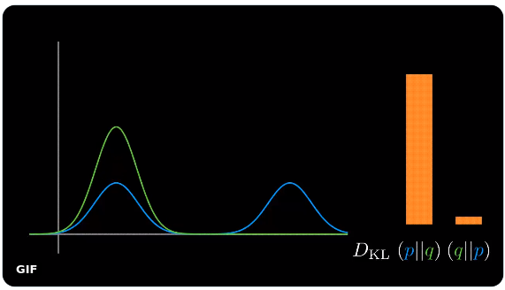

--- 
title: "Draft of My Thesis"
author: "Minh Vu"
date: "`r Sys.Date()`"
site: bookdown::bookdown_site
output: bookdown::gitbook
documentclass: book
bibliography: [my-refs.bib, book.bib, packages.bib]
biblio-style: apalike
link-citations: yes
github-repo: rstudio/bookdown-demo
description: "This is a minimal example of using the bookdown package to write a book. The output format for this example is bookdown::gitbook."
---

# What to Write and Where to Find {-}

A list of basic concept that I want to explain and the good resource to follow/base on.

+ Probability Mass:
  Concentration of Measure: Why we calculate $\mathbb{E}_{\pi}[f]$
  [Betancourt MLSS2019](https://videoken.com/embed/UzcLe-kpMDQ?tocitem=2)

+ KL forward and revserse:
  Difference between $KL[p||q]$ and $KL[q||p]$.
  [Ari Seff's visualization](https://twitter.com/i/status/1303741288911638530)
  
  
+ Non linear maninfold:
  HD data are embedded in much lower dimensional space
  Intro chap 12 Bishop [@bishop_pattern_2006].
